# D&D Workflow Code Flow Documentation

This document provides Mermaid diagrams to visualize the code flow and decision paths in the D&D Workflow project.

## Table of Contents

1. [Main Pipeline Overview](#main-pipeline-overview)
2. [Whisper Transcription Flow](#whisper-transcription-flow)
3. [Perplexity Notes Generation Flow](#perplexity-notes-generation-flow)
4. [Text-to-Speech Flow](#text-to-speech-flow)
5. [Audio Processing Flow](#audio-processing-flow)
6. [Wiki.js Publishing Flow](#wikijs-publishing-flow)
7. [File Distribution Flow](#file-distribution-flow)
8. [Error Handling and Checkpointing](#error-handling-and-checkpointing)

## Main Pipeline Overview

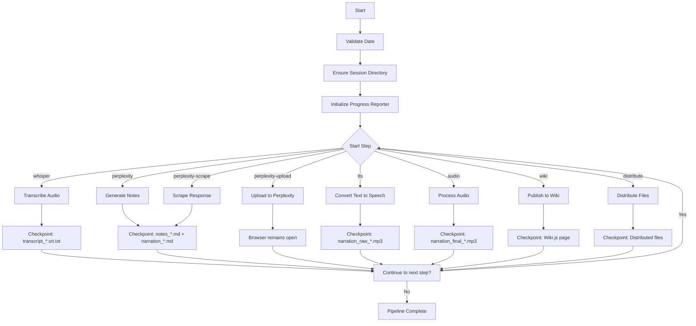

## Whisper Transcription Flow

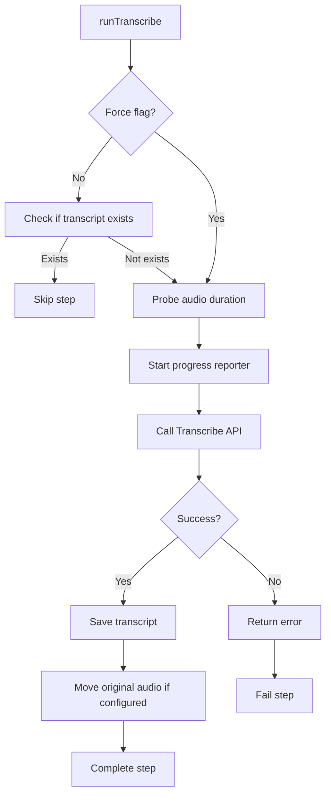

## Perplexity Notes Generation Flow

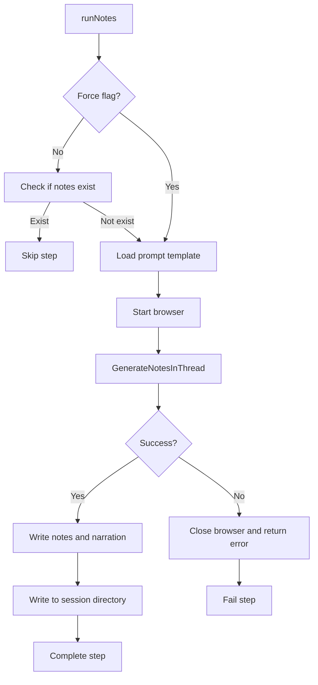

## Perplexity Upload and Scrape Flow

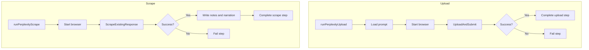

## Text-to-Speech Flow

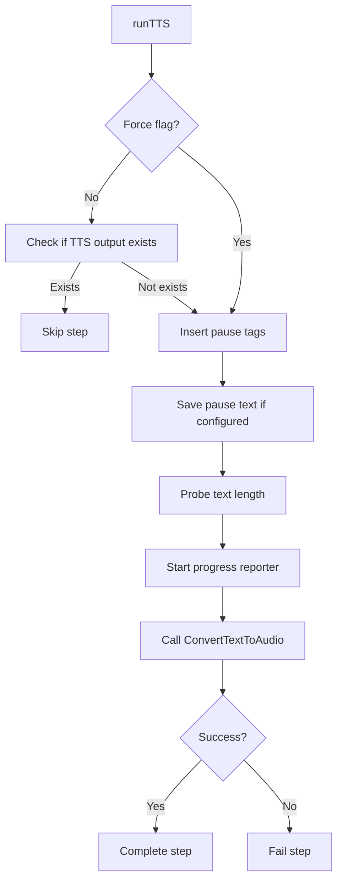

## Audio Processing Flow

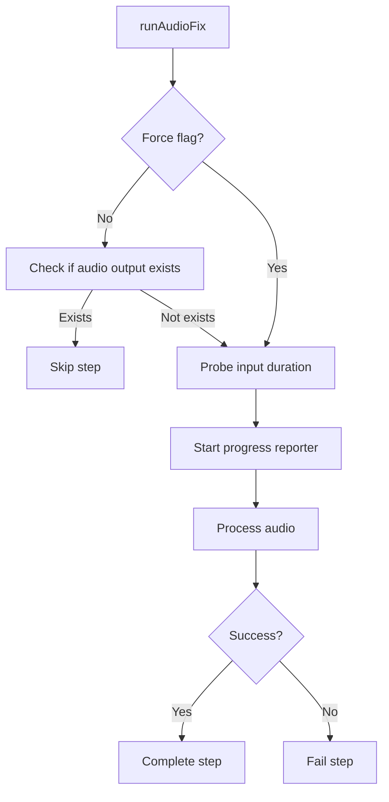

## Wiki.js Publishing Flow

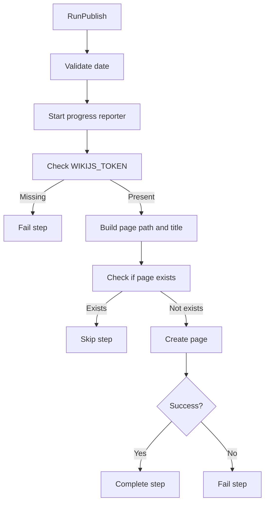

## File Distribution Flow

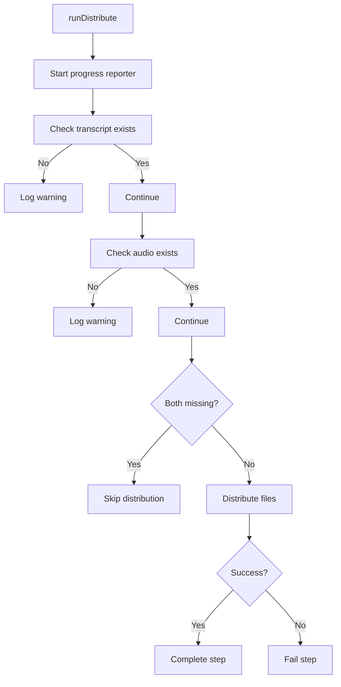

## Error Handling and Checkpointing

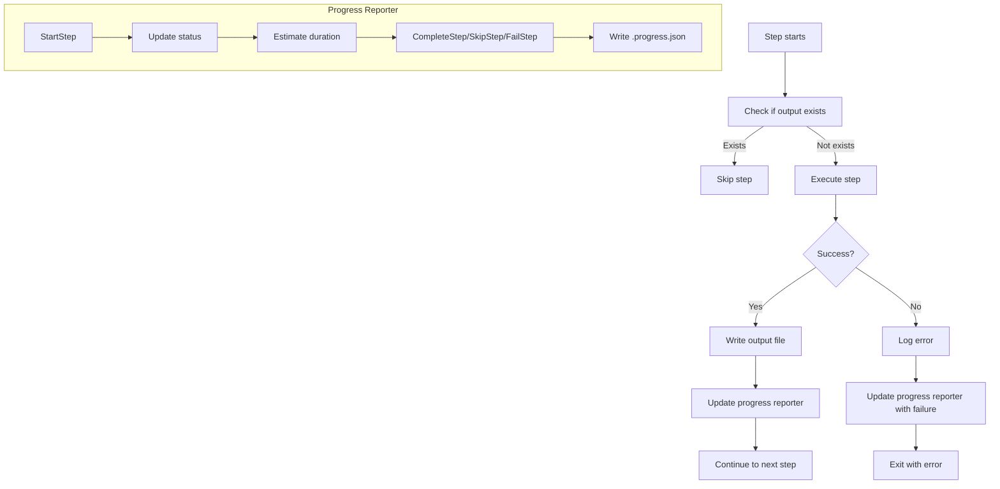

## Decision Points and Configuration

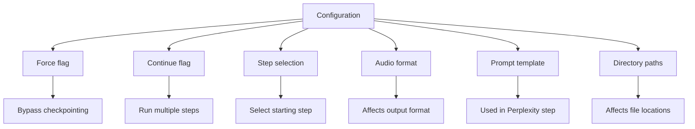

## Data Flow Between Steps

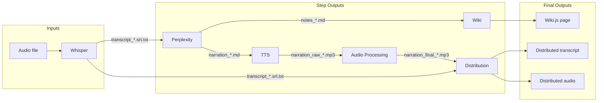

## Key Components and Their Responsibilities

| Component | Responsibility | Key Methods |
|-----------|---------------|-------------|
| `Runner` | Orchestrates pipeline execution | `RunFrom`, `runTranscribe`, `runNotes`, etc. |
| `Transcriber` | Handles audio transcription | `Transcribe` |
| `NotesGenerator` | Generates notes from transcript | `GenerateNotesInThread`, `UploadAndSubmit`, `ScrapeExistingResponse` |
| `Speaker` | Converts text to speech | `ConvertTextToAudio` |
| `AudioFixer` | Processes audio files | `Process` |
| `Publisher` | Publishes to Wiki.js | `CreatePage`, `CheckPageExists` |
| `FileDistributor` | Distributes final files | `Distribute`, `MoveOriginalAudio` |
| `Reporter` | Tracks progress and benchmarks | `StartStep`, `CompleteStep`, `EstimateStepDuration` |

## Checkpointing Strategy

The pipeline uses file-based checkpointing to avoid re-running completed steps:

1. Each step checks for the existence of its output file(s)
2. If files exist and `--force` is not set, the step is skipped
3. Checkpoint files are stored in the session directory: `output/<date>/`
4. The `--force` flag bypasses checkpointing for testing/recovery

## Error Handling Flow

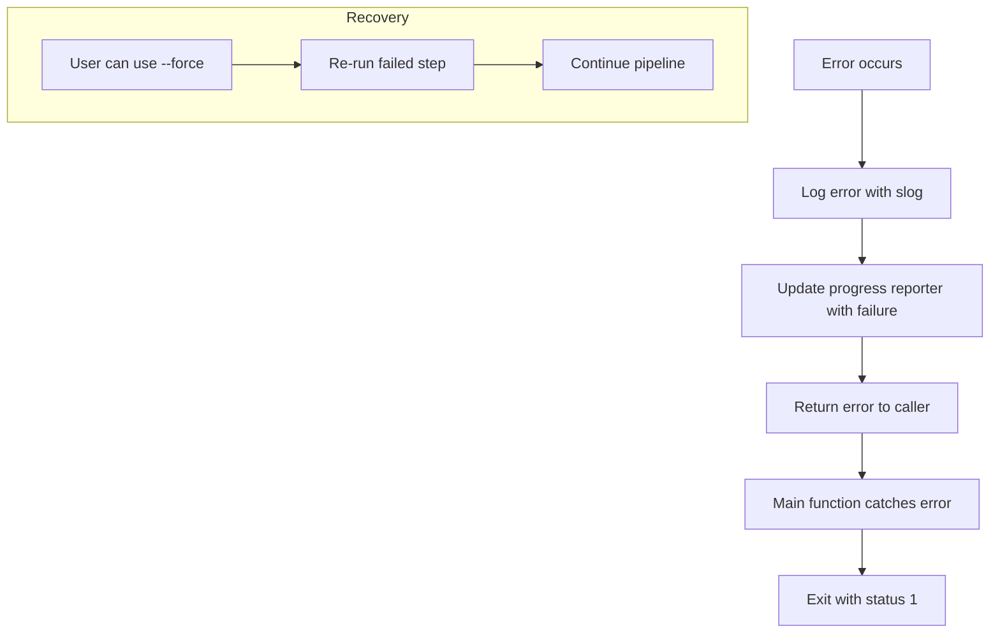