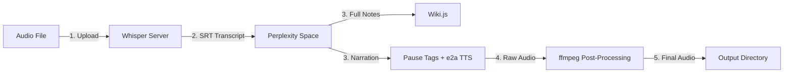

# D&D Session Workflow Automation

## Architecture



## Language and Binary Strategy

**Go** -- compiles to a single binary. Default build shells out to system `ffmpeg`/`ffprobe`. An optional `statigo` build tag links FFmpeg statically via [ffmpeg-statigo](https://github.com/linuxmatters/ffmpeg-statigo).

**Complexity constraint:** All functions target cyclomatic complexity of 12 or less.

**Runtime dependencies:**

- Google Chrome or Chromium (for chromedp -- Perplexity automation)
- `ffmpeg` and `ffprobe` on PATH (default build), or none if using statigo build

## Project Structure

```
D&D_Workflow/
  go.mod
  go.sum
  Makefile
  config.yaml.example        # Reference config with documented defaults
  config.yaml                # User config (gitignored)
  prompts/
    session_notes.txt         # Reusable Perplexity prompt template
  cmd/
    dnd-workflow/
      main.go                 # CLI entrypoint (cobra)
  internal/
    config/
      config.go               # YAML + env var config loader with tiered defaults
    whisper/
      client.go               # Upload, poll, SRT generation (config-driven)
    perplexity/
      browser.go              # chromedp Space automation (config-driven selectors/timing)
      selectors.go            # Selector helpers
    tts/
      client.go               # Gradio e2a endpoint (auto-discovered Gradio 5 API endpoints)
      pausetags.go            # Inline SML pause tag injection with heading stripping
    audio/
      types.go                # Shared types (SilenceRange) and copyFile helper
      helpers.go              # Shared pure-Go helpers (findShortGaps, estimateDuration, etc.)
      probe_exec.go           # Duration probing via ffprobe CLI (!statigo)
      probe_statigo.go        # Duration probing via avformat C bindings (statigo)
      processor.go            # Silence detection + pause injection via ffmpeg CLI (!statigo)
      processor_statigo.go    # Silence detection + pause injection via C bindings (statigo)
      detect_statigo.go       # avfilter silencedetect helpers (statigo)
      transcode_statigo.go    # Decode-insert-encode pipeline helpers (statigo)
    wikijs/
      client.go               # GraphQL page creation + dedup check
    pipeline/
      runner.go               # Orchestrates all steps with checkpoint/resume
  scripts/
    discover_gradio.py        # One-off: maps e2a Gradio API endpoints (legacy; runtime auto-discovery preferred)
```

## Configuration

All operational parameters are externalized into `config.yaml`. The `config.yaml.example` file uses three tiers:

1. **Required/user-must-set** -- uncommented, placeholder values
2. **Commonly adjusted** -- uncommented, working defaults with comments
3. **Known working defaults** -- commented out, only for advanced tuning

TTS endpoint names are configured via `gradio_api_names` (string values like `/change_gr_restore_session`) rather than numeric indices, and are resolved to `fn_index` at runtime. The `output_channel` setting (default `"mono"`) controls the audio channel layout sent to e2a.

Sensitive values (`WIKIJS_TOKEN`) are loaded from environment variables.

## Features

### Checkpoint/Resume
Each pipeline step checks if its output file already exists. If so, the step is skipped. Use `--force` to re-run all steps regardless.

### Wiki Page Deduplication
Before publishing, the pipeline queries Wiki.js to check if a page at the target path already exists. If found, the publish step is skipped.

### TTS Pause Tag Injection
Before sending narration text to TTS, paragraph and section boundaries receive inline `[pause:N]` SML tags (space-delimited, no double newlines) controlled by `audio.paragraph_pause_sec` and `audio.section_pause_sec`. Markdown heading markers (`#`, `##`, etc.) are stripped so they aren't spoken aloud. The inline format avoids conflicting with e2a's internal `\n{2,}` preprocessing.

### e2a Compatibility (Gradio 5)
The TTS client auto-discovers Gradio function indices at runtime by fetching the server's `/config` endpoint. This maps `api_name` strings (e.g., `change_gr_restore_session`) to numeric `fn_index` values, eliminating the need to hardcode indices that break on server upgrades. Config uses `gradio_api_names` (strings) instead of `gradio_fn_indices` (ints). Requires ebook2audiobook v26+ (Gradio 5).

### ffmpeg-statigo Build
Audio processing supports two build modes via the `statigo` build tag:
- **Default**: shells out to `ffmpeg`/`ffprobe` CLI (must be on PATH)
- **`make build-statigo`**: links FFmpeg 8.0.1 libraries statically via [ffmpeg-statigo](https://github.com/linuxmatters/ffmpeg-statigo), producing a self-contained binary with no ffmpeg/ffprobe runtime dependency

The statigo build uses `avformat` for duration probing, `avfilter` with the `silencedetect` filter for silence detection, and a decode-insert-encode pipeline for pause injection. Shared pure-Go helpers (`findShortGaps`, `estimateDuration`, `buildSegmentFilter`) live in `helpers.go` (no build tag) and are used by both builds.

## CLI

```
dnd-workflow run --audio recording.mp3 [--date 2026-03-22] [--force]
dnd-workflow transcribe --audio recording.mp3 [--date 2026-03-22]
dnd-workflow notes --srt transcript.srt [--date 2026-03-22]
dnd-workflow tts --text summary.md [--date 2026-03-22]
dnd-workflow audio-fix --input raw.mp3 [--date 2026-03-22]
dnd-workflow publish --content notes.md [--date 2026-03-22]
```

## Go Dependencies

- `github.com/chromedp/chromedp` -- Chrome DevTools Protocol
- `github.com/spf13/cobra` -- CLI framework
- `gopkg.in/yaml.v3` -- YAML config parsing
- Standard library `net/http`, `encoding/json`, `mime/multipart`
- *(Optional)* `github.com/linuxmatters/ffmpeg-statigo` -- static FFmpeg bindings

## Build

```bash
# Standard build (requires ffmpeg on PATH at runtime)
go build -ldflags="-s -w" -o dnd-workflow ./cmd/dnd-workflow

# Optional statigo build (self-contained binary)
make build-statigo
```
